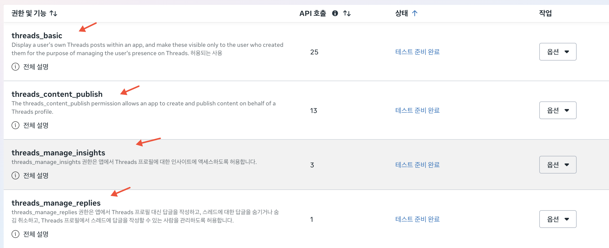

# Threads API 토큰 발급 가이드

**처음 접속하는 분을 기준으로, 위에서 아래 순서대로 진행합니다.** 원문 화면 이미지 21개를 같은 순서로 넣고, 실제로 선택할 권한 4개가 표시된 이미지를 추가했습니다. 사진을 누르면 크게 볼 수 있습니다.

준비물: **Facebook 계정 · 글을 게시할 본인 Threads 계정 · 문자 인증을 받을 휴대폰 · 본인 이메일**

Facebook 계정이 없다면 Facebook 로그인 화면의 **새 계정 만들기**에서 먼저 가입합니다. 아래 과정에서는 Facebook 로그인 후 **Meta for Developers 계정도 처음 한 번 등록**합니다.

## 1. Meta 사이트에 접속하고 ‘내 앱’ 누르기

1. [Meta 개발자 사이트 열기](https://developers.facebook.com/)를 누릅니다.
2. 본인의 **Facebook 계정**으로 로그인합니다.
3. 오른쪽 위 **내 앱**을 누릅니다.


## 2. 처음이라면 Meta for Developers 계정 만들기

**처음 ‘내 앱’에 들어가면 개발자 계정 등록이 필요합니다.** 아래 사진의 ① → ② → ③ → ④ 순서로 진행합니다. 이미 등록한 계정이라 앱 목록이 보이면 3번으로 넘어갑니다.

1. **① Register:** **Continue(계속)**를 누릅니다.
2. **② Verify account:** **Mobile number**에 본인 휴대폰 번호를 넣고 **Send Verification SMS**를 누릅니다. 문자로 받은 인증번호를 입력해 인증을 마칩니다.
3. **③ Contact info:** 표시된 이메일이 본인 이메일인지 확인하고 **Confirm Email**을 누릅니다. 주소를 고쳐야 하면 **Update Email**을 눌러 본인이 받는 이메일로 바꿉니다. **홍보 이메일 수신 체크박스는 체크하지 않습니다.** 이메일 인증을 요청하면 받은 메일에서 인증을 마칩니다.
4. **④ About you:** 사용 목적은 **Developer**를 선택합니다. 오른쪽 아래 **Complete Registration**을 누릅니다.

**사용 목적은 ‘Developer’로 선택합니다.** 등록을 마치고 앱 목록이 나오면 다음으로 진행합니다.


## 3. ‘앱 만들기’ 누르기

앱 목록 오른쪽 위의 **앱 만들기**를 누릅니다. 처음이라 목록이 비어 있어도 같은 버튼을 누르면 됩니다.


## 4. 앱 이름과 이메일 입력하기

1. **앱 이름:** 본인 **Threads 아이디에서 @를 뺀 이름**을 그대로 입력합니다. 예를 들어 `@myaccount`라면 `myaccount`를 입력합니다.
2. **앱 연락처 이메일:** 본인이 실제로 메일을 받는 이메일 주소를 입력합니다.
3. 오른쪽 아래 **다음**을 누릅니다.

이후 이 가이드에서 ‘만든 앱’을 선택하라고 하면, 여기서 입력한 앱 이름을 찾으면 됩니다.


## 5. 이용 사례 3개 선택하기

1. 왼쪽 **콘텐츠 관리**를 누릅니다.
2. 아래 사진처럼 **Threads API 액세스**, **Instagram에서 메시지 및 콘텐츠 관리**, **페이지의 모든 부분 관리**를 모두 체크합니다.
3. **3개가 체크된 상태**에서 **다음**을 누릅니다.


## 6. 비즈니스 포트폴리오 연결하지 않기

1. **아직 비즈니스 포트폴리오를 연결하고 싶지 않음**을 선택합니다.
2. 오른쪽 아래 **다음**을 누릅니다.


## 7. 요구 사항 화면에서 ‘다음’ 누르기

아래처럼 **확인된 요구 사항이 없습니다**가 표시되면, 추가로 입력할 내용 없이 오른쪽 아래 **다음**을 누릅니다.


## 8. 내용을 확인하고 앱 만들기

1. **앱 이름**과 **앱 이메일**이 본인이 입력한 내용인지 확인합니다.
2. **이용 사례**에 **5번에서 선택한 3개 항목**이 있는지 확인합니다.
3. 오른쪽 아래 **앱 만들기**를 누릅니다. Facebook 비밀번호 확인이 나오면 입력합니다.

앱 **대시보드**가 열리면 앱 생성이 끝난 것입니다.


## 9. Threads API 맞춤 설정 열기

대시보드의 **Threads API 액세스 맞춤 설정 이용 사례** 오른쪽 화살표를 누릅니다.

아래 사진에 보이는 Instagram·페이지 항목이나 **앱을 게시하세요**는 누르지 않습니다.


## 10. 권한 4개 추가하기

**이용 사례 → 권한 및 기능**에서 **아래 4개를 모두 추가**합니다. 각 항목 오른쪽의 **추가**를 누릅니다. 이미 **테스트 준비 완료**로 표시되면 그대로 둡니다.

- `threads_basic` — 내 Threads 계정 확인
- `threads_content_publish` — 게시글 올리기
- `threads_manage_insights` — 조회수·좋아요 등 통계 확인
- `threads_manage_replies` — 댓글 올리기

화면을 아래로 내려 4개를 모두 찾습니다. **위 4개 외의 권한은 추가하지 않습니다.**

아래 원문 사진에서는 **추가 버튼의 위치**를 확인합니다.


<p class="important"><strong>최종 권한 설정은 아래 이미지를 그대로 따릅니다.</strong> 원문 사이트와 달리 <strong>위 4개가 모두 ‘테스트 준비 완료’</strong>여야 합니다. 확인한 뒤 11번으로 진행합니다.</p>



## 11. 권한 추가를 마치고 ‘앱 역할’ 열기

1. **10번의 권한 4개가 모두 테스트 준비 완료**인지 확인합니다.
2. 왼쪽 아래 **앱 역할**을 누릅니다. 메뉴가 아이콘으로만 보이면 아래 사진의 빨간 표시 위치에 마우스를 올려 **앱 역할**을 찾습니다.
3. 펼쳐진 메뉴에서 **역할**을 누릅니다.

아래 원문 사진에서는 **앱 역할 메뉴의 위치만 확인**합니다. 권한 목록은 **10번의 4개**를 기준으로 합니다.


## 12. 본인 계정을 Threads 테스터로 추가하기

1. 오른쪽 위 **사람 추가**를 누릅니다.
2. 역할에서 **테스터**를 선택합니다.
3. 아래쪽의 **Threads 테스터**를 선택합니다.
4. 입력칸에서 **글을 게시할 본인 Threads 아이디**를 검색하고, 검색 결과에서 본인 계정을 선택합니다.
5. 오른쪽 아래 **추가**를 누릅니다.


## 13. ‘대기 중’ 상태 확인하기

추가한 본인 계정 옆에 **Threads 테스터**와 **대기 중**이 보이는지 확인합니다.

**대기 중이 보이면 정상입니다.** 이제 본인이 Threads에 들어가 초대를 수락해야 합니다. 기다리지 말고 14번으로 진행합니다.


## 14. Threads에 로그인하고 설정 열기

1. Meta 화면은 열어 둡니다. 새 탭에서 [Threads 열기](https://www.threads.com/)를 누릅니다.
2. **12번에서 추가한 본인 Threads 계정**으로 로그인합니다.
3. 왼쪽 아래 **더 보기**를 누릅니다.
4. **설정**을 누릅니다.


## 15. 웹사이트 권한 열기

1. 설정에서 **계정** 또는 **설정 더 보기**를 누릅니다. 화면에 표시되는 이름을 누르면 됩니다.
2. **웹사이트 권한**을 누릅니다.


## 16. 내 앱의 초대 수락하기

1. 위쪽 **초대** 탭을 누릅니다.
2. **4번에서 입력한 앱 이름**을 찾습니다.
3. 해당 앱 오른쪽의 **수락**을 누릅니다.


## 17. Meta로 돌아와 수락 완료 확인하기

1. 열어 둔 **Meta 앱 역할 화면**으로 돌아옵니다.
2. 브라우저의 **새로고침**을 누릅니다. Windows에서는 **Ctrl+R**을 눌러도 됩니다.
3. 본인 계정의 **대기 중 표시가 사라졌는지** 확인합니다.

아래 사진처럼 상태 칸에서 대기 중이 없어지면 다음으로 진행합니다.


## 18. 그래프 API 탐색기 열기

Meta 사이트 상단에서 **도구 → 그래프 API 탐색기**를 누릅니다.


## 19. 1시간짜리 임시 토큰 만들기

1. 위쪽 주소 선택을 **`.facebook.com`에서 `.threads.net`으로 변경**합니다.
2. 오른쪽 **Meta 앱**에서 **4번에서 만든 앱**을 선택합니다.
3. **앱을 선택하면 주소가 초기화될 수 있습니다.** 위쪽 주소가 **`.threads.net`인지 다시 확인**합니다. **`.facebook.com`으로 바뀌었다면 `.threads.net`으로 다시 변경**합니다.
4. **권한(Permissions)** 선택 목록이 나오면 10번의 네 가지 권한을 선택합니다.
5. 주소가 **`.threads.net`인 상태에서 Generate Threads Access Token**을 누릅니다.
6. Threads 로그인이나 권한 승인 화면이 나오면 **12번에서 추가한 본인 계정**으로 진행하고, 요청한 권한을 모두 허용합니다.
7. 오른쪽 **액세스 토큰** 칸에 긴 문자열이 생기면 다음으로 진행합니다.


**지금 나온 토큰은 약 1시간만 사용할 수 있습니다.** 이 탐색기 탭을 열어 둔 채 20번으로 진행합니다. 21번에서 60일 토큰으로 바꿉니다.

## 20. 앱 시크릿 코드 확인하기

1. 새 탭에서 [Meta 내 앱 열기](https://developers.facebook.com/apps/)를 누릅니다.
2. **4번에서 만든 앱**을 엽니다.
3. 왼쪽 **앱 설정 → 기본 설정**으로 들어갑니다.
4. **아래 사진의 빨간 네모로 표시된 앱 시크릿 코드**를 찾습니다.
5. 그 줄 오른쪽의 **보기**를 누릅니다.
6. **Facebook 비밀번호**를 입력하고 확인합니다.
7. 앱 시크릿 코드가 보이면 이 탭을 열어 둡니다. 다음 단계에서 복사합니다.


## 21. 임시 토큰을 60일 토큰으로 바꾸기

1. **19번의 그래프 API 탐색기 탭**으로 돌아옵니다.
2. 요청 방식은 **GET**, 주소 선택은 **`.threads.net`**으로 둡니다.
3. 아래 요청문을 복사합니다. 탐색기 위쪽의 주소 입력칸에 있던 `me?fields=...` 같은 기존 내용을 지우고 붙여넣습니다.

```text
access_token?grant_type=th_exchange_token&client_secret=여기에_앱_시크릿&access_token=여기에_1시간_토큰
```

4. 요청문의 `여기에_앱_시크릿` 부분을 바꿉니다. **20번 탭**에서 **앱 시크릿 코드**를 복사한 뒤, 탐색기로 돌아와 **이 한글 부분만 지우고** 붙여넣습니다.
5. 요청문의 `여기에_1시간_토큰` 부분을 바꿉니다. 탐색기 **오른쪽 액세스 토큰 칸의 복사 아이콘**을 누른 뒤, **이 한글 부분만 지우고** 붙여넣습니다.
6. 한글 안내 문구 두 곳이 모두 본인의 값으로 바뀌었는지 확인합니다. 나머지 영문과 `&`, `=`는 그대로 둡니다. 값에 따옴표나 중괄호를 붙이지 않습니다.
7. 오른쪽 위 **제출**을 누릅니다.


위 사진은 **요청문을 넣는 위치**를 보여주는 예시입니다. 사진 가운데의 `id`, `name`은 60일 토큰 발급 결과가 아닙니다. 제출 후에는 22번처럼 새 결과가 나와야 합니다.

## 22. 가운데 결과에서 60일 토큰 복사하기

제출 후 **가운데 결과 화면**에서 `access_token`, `token_type`, `expires_in`을 찾습니다. 아래는 결과의 모양이며, 실제로는 본인의 긴 토큰 문자열이 표시됩니다.

```json
{
  "access_token": "새로_발급된_60일_토큰",
  "token_type": "bearer",
  "expires_in": 5184000
}
```

1. `expires_in`이 약 **5,184,000초(60일)**인지 확인합니다.
2. **가운데 결과의 `access_token` 오른쪽 긴 문자열만 복사**합니다. 양끝의 따옴표는 제외합니다.

**오른쪽 액세스 토큰 칸에는 아직 1시간 토큰이 있습니다. 로컬 앱에 넣을 것은 가운데 결과에 새로 나온 60일 토큰입니다.**

## 23. 로컬 앱에 저장하고 연결 확인하기

1. **Threads Media Manager**를 엽니다.
2. 오른쪽 위 **설정(⚙️) → Threads 계정**으로 들어갑니다. 이미 계정이 표시되어 있으면 **토큰 교체**를 눌러 입력칸을 엽니다.
3. **API 토큰** 칸에 **22번에서 복사한 60일 토큰**을 붙여넣습니다.
4. **저장**을 누릅니다.
5. **본인 계정명 · 연결됨 · 만료 일시**가 표시되는지 확인합니다. 만료 일시는 발급 시점에서 약 60일 뒤입니다.

여기까지 나오면 연결이 끝났습니다. 이어서 [로컬 앱 가이드](windows-install-test.md)의 **파일 서버 연결 코드 입력**부터 진행합니다.

토큰과 앱 시크릿은 비밀번호처럼 다룹니다. 채팅이나 다른 사람에게 보내지 않습니다.

## 막히면 여기만 확인하기

- **가입을 끝냈는데 앱이 없어요:** 정상입니다. 3번의 **앱 만들기**부터 진행합니다.
- **Threads에 초대가 없어요:** 12번에서 추가한 아이디와 14번에서 로그인한 계정이 같은지 확인합니다.
- **계속 대기 중이에요:** Threads의 **초대** 탭에서 수락했는지 확인한 뒤 Meta 화면을 새로고침합니다.
- **60일 토큰 결과가 안 나와요:** 주소가 **`.threads.net`**인지, **20번의 앱 시크릿 코드**와 **1시간 토큰**을 각각 맞는 자리에 넣었는지 확인합니다. 한글 안내 문구가 남아 있으면 본인의 값으로 바꿉니다.
- **토큰이 금방 만료돼요:** 22번 가운데 결과의 토큰을 복사했는지 확인합니다.
- **게시·댓글·통계에서 권한 오류가 나요:** 10번의 네 가지 권한을 모두 추가했는지 확인한 뒤, 19번부터 토큰을 다시 발급합니다. 로그인 후 권한 승인 화면에서는 요청한 권한을 모두 허용합니다.
- **토큰이 이미 만료됐어요:** 18~23번을 다시 진행합니다. 앱은 실행 중에 유효한 장기 토큰을 갱신하지만, 이미 만료된 토큰은 새로 발급해야 합니다.

## 참조

- [스레드 API 액세스 토큰 발급받는 법](https://brunch.co.kr/@sonteady/101)
- [Meta: Threads 앱 만들기](https://developers.facebook.com/documentation/threads/get-started/create-an-app?locale=en_US)
- [Meta: Threads 시작하기·테스터 연결](https://developers.facebook.com/documentation/threads/get-started?locale=en_US)
- [Meta: 답글 작성 권한](https://developers.facebook.com/docs/permissions/reference/threads_manage_replies?locale=en_US)
- [Meta: 장기 토큰 발급과 갱신](https://developers.facebook.com/documentation/threads/get-started/long-lived-tokens?locale=en_US)
- [Meta: 그래프 API 탐색기와 권한 확인](https://developers.facebook.com/docs/graph-api/guides/explorer?locale=en_US)
