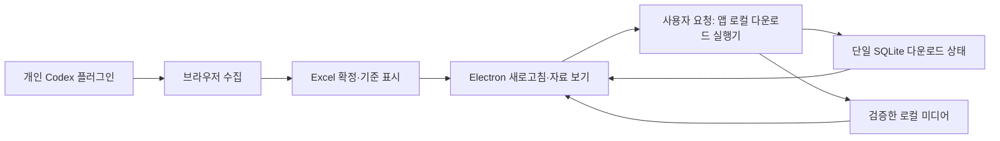

# Phase 1 설계

2026-09-21 구현 현황: 1D 파일 하나 다운로드 앱 연결과 현재 수집된 첨부20개 저장을 Mac에서 검증했다. 사용자 요청으로 1E 전에 이미지 중심 그리드·상세 모달·첨부 캐러셀을 적용했다. [화면 구현과 검증](gallery-ui.md), [다운로드 검증](phase-1d-download.md)을 확인한다. 자동 회차는1E, Windows 실제 검증·배포는1G다.

상태: 설계 초안 v3 / 2026-09-21. 플러그인은 수집 전용이고 로컬 앱이 다운로드·자료 관리를 담당한다. 검증된 단일 파일 파일럿은 `local-runtime/`으로 이동해 보존하며 이동 자체는 앱·배치 기능 완성이 아니다. 사용자 결정으로 다운로드 일일 횟수 제한은 없으며 redirect0회·대기·중단 기준은 [로컬 실행기 계약](local-download-runner.md)을 따른다. 미완성 배치 초안은 별도 임시 경로에 보존하고 90회 정책은 적용하지 않는다. 파일 하나 앱 UI는1D에서 연결했으며 자동 회차·Windows 설치 도우미는 후속 구현이다.

플랫폼 기준: 모든 기능은 Mac과 Windows를 지원한다. 개발과 1A–1F 단계별 테스트는 Mac에서 수행하고, 구현 완료 후 마지막 1G에서 Windows 기능·설치·업데이트를 검증한다. Mac은 개발 환경 직접 실행만 제공하고 설치 파일을 배포하지 않는다.

## 1. 사용자 흐름과 화면

멤버는 개인 Codex 계정과 본인의 Threads 로그인 세션으로 수집 플러그인을 사용한다. 설치·설정·업데이트는 [플러그인 배포 설계](plugin-distribution.md)를 따른다. 초기 설정은 도구·설치 점검, 수집 폴더 선택과 계정 Excel 준비, 로그인 안내까지 수행한다. Electron 앱 자체 로그인은 없다.

초기 설정 helper는 사용자 홈 `.threads-media-manager/settings.json`에 `schema_version`과 `collection_root`만 보관한다. 계정·기준·다운로드 상태를 복제하거나 state/media·DB를 선행 생성하지 않는다. 앱의 로컬 실행기가 최초 다운로드 상태 준비 시 기존 수집 위치를 보존하며 state/media를 준비한다.

플러그인은 accounts의 활성 계정·순서를 고정하고 A 수집→임시 JSONL 종료·Excel 원본 확정·기준 표시→수집 계정 간 휴식→B 수집을 진행한다. 최초 미디어 원글 10건·증분 최대 20건·이전 기준 ID·하루 한 번 기본 규칙은 유지한다. 수집 중에는 JSONL로 누적하고 계정 종료 시 후처리한다. 플러그인은 다운로드를 시작하지 않으며 state.db·다운로드 중단 상태를 읽거나 쓰지 않는다.

앱은 시작·명시적 새로고침에 검증된 Excel을 읽고 사용자가 별도로 다운로드를 요청하면 대상·회차·정책·대기를 보여준다. 앱이 브라우저 수집을 호출하지 않는다. 새로고침·새 Excel·새 주소로 다운로드를 자동 시작하거나 중단을 해제하지 않는다.

수집 오류는 해당 수집 실행의 후속 계정을 중단한다. 다운로드 오류는 앱 다운로드 전체를 중단한다. 다운로드 실패는 결과 Excel·수집 기준을 되돌리지 않는다. 나중에 별도로 요청한 수집은 수집 자체 가드와 공통 잠금 조건을 만족하면 진행할 수 있고 앱 DB 오류 때문에 자동 금지되지 않는다.

Electron은 local-video-manager를 참고한 이미지 중심 카드 그리드로 게시글을 보여준다. 카드를 누르면 상단에 미디어, 하단에 계정·캡션·정보를 둔 상세 모달을 연다. 여러 첨부는 목록과 상세 모두 캐러셀을 쓰고 현재 첨부 위치를 공유한다. 상단에는 폴더 연결·새로고침·다운로드 패널 열기를, 목록 앞에는 계정/저장 상태 필터·검색을 둔다. 다운로드 패널은 필요할 때 열고 활성 작업·오류·복구 안내는 계속 보인다. 아직 구현하지 않은 제어 기능을 현재 지원으로 표시하지 않는다. 다운로드의 단일 명령 경로는 앱의 로컬 실행기이며 renderer나 다른 서비스에 별도 CDN 엔진을 두지 않는다. 계정 필터로 다음 파일의 대상 계정을 선택한다. Phase 1 캡션은 읽기 전용이다.

상세에는 계정·원문 링크·등록일·캡션·순서 있는 첨부·수집 미완료/누락 가능성·첨부별 다운로드 상태와 사유를 표시한다. 수집일/최근확인시각·URL확보시각·만료 추정은 정보 영역에 둔다. CDN URL을 img/video에 넣지 않고 다운로드 전에는 로컬 placeholder를 쓴다. 영상은 자동재생하지 않는다. `다운로드됨 3/확인된 첨부 3`이어도 수집 partial을 실제 전체 첨부 확보로 표시하지 않는다.

## 2. 저장 위치와 구성

```text
선택한 수집 루트/                플러그인 설치·업데이트 경로 밖
  accounts.xlsx
  results/YYYY/MM/threads-YYYY-MM-DD.xlsx
  backups/  _work/
  state/
    state.db                      앱 로컬 실행기만 쓰는 단일 SQLite
    logs/                         서명 URL·원문 캡션 일반 로그 제외
  media/                          현재 파일럿은 수집 루트 아래 고정
    .library.json                 library UUID
    files/<게시글 UUID>/<첨부 UUID>.<확인된 확장자>
    .partial/<시도 UUID>.part

Electron 전용 userData/
  cache/                          재생성 가능한 표시 자료·화면 설정
```

폴더는 처음에 하나의 기본 위치로 준비하되 사용자가 바꿀 수 있다. 사용자별 절대 경로는 배포 코드에 넣지 않는다. Phase 1은 하나의 results 루트와 하나의 미디어 루트를 지원한다. 앱 실행기가 library UUID를 발급하고 DB에 루트 및 상대 파일 경로를 저장한다. 앱은 수집 데이터 폴더를 연결하며 다운로드 상태 DB를 한 곳에서 관리한다. 플러그인은 DB를 생성하거나 열지 않는다. 플러그인 코드·캐시는 이 사용자 데이터와 분리한다.

새 라이브러리는 비어 있는 폴더로 시작한다. 기존 미디어 루트는 현재 state.db의 library UUID와 파일 연결 키가 일치할 때만 재연결한다. 대응 DB가 없거나 다른 DB가 소유한 루트에는 새 쓰기를 막고 복구를 안내한다. 식별 파일만으로 게시글 연결을 복원할 수는 없다. 미디어를 보유한 뒤 루트 변경은 같은 라이브러리의 이동 폴더 재연결만 허용하며 자동 이동·병합은 Phase 1에서 제외한다.

앱의 로컬 실행기가 DB 쓰기·다운로드·상태 변경을 직렬화한다. 활성 수집과 다운로드는 루트의 `_work/collector.lock`을 공통 실행 잠금으로 사용해 겹치지 않게 한다. 소유자·토큰을 검증하고 타 실행 잠금을 임의 제거하지 않는다. 앱 단순 열기·마지막 정상 화면 조회는 잠금을 독점하지 않는다. 오류를 기록하고 활성 다운로드가 종료되면 잠금은 해제하되 DB 중단 상태는 보존한다. 플러그인은 이 DB를 검사하지 않는다.

새로고침의 원본 스캔·계획 확정도 잠금 아래 진행하고 수집 중이면 완료 후 다시 시도하도록 안내한다. 개발·운영 데이터 폴더는 분리한다. 파일명에는 캡션·계정명·서명 URL을 쓰지 않는다. Windows·Mac의 절대 경로를 호환되는 문자열로 취급하지 않는다.



## 3. 원본 읽기·갱신

결과 Excel의 완료·partial 실행이 원본이며 daily-v1 어댑터를 정상 읽기 경로에서 사용한다. 앱은 시작·사용자 새로고침·명시적 재개 때 Excel을 안정적으로 읽는다. 플러그인의 다운로드 인계 호출은 없다. Phase 1에서 자동 폴더 감시를 전제하지 않는다. 최초 실행은 전체 일별 파일을 읽고 같은 실행 안에서는 hash가 동일한 파싱 결과를 재사용할 수 있다. 재시작 후에는 Excel 원본을 다시 읽고 기존 SQLite 작업에 연결한다.

파일별 크기·수정 시각은 힌트이고 내용 SHA-256이 버전 식별자다. 잠금을 획득한 뒤 읽기 전후 경로·크기·수정 시각과 읽은 내용을 검증하고 Excel daily-v1 형식·실행/게시글/첨부 연결을 확인한다. 손상·running·읽기 중 변경·충돌이 있으면 새 스캔을 채택하지 않는다. 잠금 규약을 무시하는 외부 편집까지 완전한 무잠금 감지로 보장하지 않는다.

전체 결과 검증 후 메모리 모델을 교체한다. 실패하면 직전 정상 화면을 유지할 수 있으나 `원본 변경/확인 필요`로 표시하고 해당 원본의 새 다운로드는 시작하지 않는다. 같은 파일명도 내용 변경을 확인한다. 확정되지 않은 running 참조는 보류하고 partial·충돌·주소 미확보는 실제 상태를 보존한다. 현재 파일 하나 파일럿은 완료 수집 실행만 전송 대상으로 삼는다.

다운로드 시작 때 유한한 대상 키·순서·원본 참조와 hash를 고정한다. 전송 직전에도 계획 원본을 검증한다. 진행 중 새 원본을 자동 편입하지 않으며 예상 밖 변경이면 앱 다운로드를 중단한다. 작업 종료 후 새로고침에서 새 확정 실행을 채택할 수 있지만 기존 중단·실패 URL·성공 파일·소비량을 지우지 않는다. 이미 완료한 파일은 원본 hash나 URL 갱신만으로 재다운로드하지 않는다.

## 4. 날짜 간 병합 규칙

키는 계약의 게시글/미디어 키를 그대로 사용한다. URL, Excel 파일명, 행 번호를 ID로 사용하지 않는다. 새 파일에 없다는 이유로 과거 행·미디어·작업 상태를 삭제하지 않는다.

| 정보           | 메모리에서 선택하는 규칙                                                                                                                                           |
| -------------- | ------------------------------------------------------------------------------------------------------------------------------------------------------------------ |
| 원문 캡션      | complete 관찰이 있으면 그중 최신 최근확인시각. 없으면 partial 중 최신, 그다음 unknown. 더 최근이지만 불완전한 관찰이 있으면 그 사실과 표시 캡션의 확인 시각도 표시 |
| 등록일         | 확인된 비어 있지 않은 값. 같은 원글의 절대 시각이 충돌하면 경고, 임의 최신값으로 덮어쓰지 않음                                                                     |
| 수집일         | 전체 보관 파일의 가장 이른 수집일과 최근 관찰 시각을 구분                                                                                                          |
| 첨부 목록      | 순서 키의 합집합을 유지. partial에서 빠진 항목은 제거하지 않음. 완전한 관찰 간 수량/종류/순서 충돌은 검토 필요                                                     |
| 다운로드 후보  | 유효한 http_candidate 중 최신 URL확보시각. 이후 관찰에서 주소가 없으면 이전 후보의 원래 시각과 '이전 관찰 주소' 표시를 유지                                        |
| 수집·주소 상태 | 선택한 각 필드의 실제 관찰 근거를 함께 표시. 서로 다른 관찰을 모두 최신 확인값이라고 합성하지 않음                                                                 |

같은 키·같은 관찰 시각인데 값이 다르면 두 원본 위치와 함께 충돌로 표시한다. 후보를 임의 선택해 다운로드하지 않는다. URL의 서명 쿼리 변경만으로 새 첨부를 만들지 않는다.

게시글/첨부 UUID와 소스 키는 최초 연결 시 고정한다. 이미 검증한 로컬 파일은 후보 URL이 달라졌다고 교체하지 않는다. 종류·명시된 첨부 연결이 충돌하면 기존 파일을 보존하고 자동 작업을 보류한다. 현재 수집 계약만으로 같은 종류의 캐러셀 순서 변경을 항상 검출할 수는 없으므로, Phase 1은 기존 첨부의 자동 교체를 지원하지 않는다.

## 5. 앱 로컬 실행기의 최소 SQLite 모델

원본 캡션·게시일·전체 서명 URL·수집 상태의 영구 복사본은 만들지 않는다. 단일 state.db는 앱의 다운로드 작업 상태이며 앱 로컬 실행기만 쓰기·복구·migration을 수행한다. 플러그인은 DB를 읽거나 쓰지 않는다. 다운로드에 쓰는 URL은 검증한 메모리 원본에서 얻는다. 재시작 시 다시 원본을 읽기 전에는 작업을 재개하지 않는다.

| 저장 대상                                    | 핵심 정보                                                                                                                                        |
| -------------------------------------------- | ------------------------------------------------------------------------------------------------------------------------------------------------ |
| 설정/라이브러리                              | schema/application ID, 선택 루트와 library UUID, 실행기/정책 호환 버전, 앱 다운로드 전체 중단 상태                                               |
| download_runs / account_steps                | 앱에서 확인한 계정 순서·다운로드 단계, 수집 실행ID·원본 참조, 다운로드 계획·진행 상태. 브라우저 수집 단계나 독립 수집 기준을 만들지 않음         |
| source_files                                 | source UUID, 상대 경로, 내용 hash, 파싱 상태/시각, 오류 위치·코드. 성공 여부와 현재 원문 보유를 혼동하지 않음                                    |
| media_items                                  | 내부 post/media UUID, 계정명·게시글ID·순서 unique 키, 출처 파일/논리 키 참조, 작업 상태, 상대 파일 경로, 확인한 종류·byte 크기·SHA-256·완료 시각 |
| download_attempts                            | attempt UUID, media UUID, 사용한 원본 내용 hash·URL hash·파일 참조, 시작/종료, 임시/최종 상대 경로, 단계, HTTP 상태·오류 코드, 저장 직전 검증값  |
| download_plans / 계획 항목 / download_rounds | 유한 작업의 원본 키·참조·순서·정책 버전·계획 상태, 회차 예약량·소비량·휴식 종료 시각. 원문 데이터 복제 없음                                      |
| network_requests / network_policy            | 요청별 허용량 소비 기록, run/account/round/attempt 연결, 호스트/redirect 단계/결과, 전역 중단 이유·최소 재개 시각. 재시작 후에도 집계·중단 유지  |

위 목록은 앱의 책임 단위이며 SQL 열/인덱스와 파일럿에서의 변경은 앱 다운로드 구현 단계에서 구체화한다. 파일 hash나 URL hash는 검증/변경 감지용이며 첨부의 주 ID가 아니다. 등록일·캡션 검색은 우선 메모리에서 처리한다.

기존 파일럿 상태의 schema·library UUID·성공 파일·소비 기록을 보존하며 local-video-manager의 DB를 열지 않는다. WAL/foreign keys와 transaction 패턴은 기반 앱을 참고한다. 열 수 없거나 손상된 DB를 빈 DB로 자동 교체하지 않는다. schema 변경 전 SQLite의 정상 백업 방식을 사용한다. WAL이 열린 상태에서 sqlite 파일 하나만 복사해 백업했다고 간주하지 않는다.

## 6. 다운로드 동작

실제 CDN 403 사례와 API 429의 차이, 복구·중단 해제는 [CDN 다운로드 가이드](cdn-download-guide.md), 계정별 회차·가드·진행 안내는 [다운로드 대기열 정책](download-queue-policy.md)을 따른다. 모든 계정을 섞어 오래된순으로 받던 이전 방식은 사용하지 않는다. 오류 코드만으로 IP 차단을 확정하지 않는다.

시작 전에 게시글의 남은 첨부 전부에 유효한 원본 참조와 허용된 후보가 있는지 확인한다. blob·주소 없음·충돌 등으로 일부 첨부를 받을 수 없는 게시글은 전체를 보류하고 사용자에게 표시한다. 전역 중단 상태가 없을 때 현재 계정에서 확정한 대상 게시글만 등록일 오래된 순서로 묶는다. 등록일 미상은 최초 수집일로 보조 정렬하고 동률은 계정·문자열 ID로 고정한다. 활성 작업은 하나만 허용하고 같은 버튼을 두 번 눌러도 중복 요청하지 않는다.

회차는 **현재 계정의 남은 첨부 합계가 목표 범위에 들어오는 게시글 묶음**이다. 초기 운영 범위는 35–45개다. 다른 계정의 첨부로 수량을 채우지 않는다. 정상 진행에서는 선택한 게시글의 수집된 첨부를 모두 검증·저장한 뒤 회차를 끝낸다. 회차 또는 일일 파일 개수 때문에 게시글 중간에서 끊지 않는다. 해당 계정의 마지막 묶음은 35개 미만이어도 처리한다. 20게시글×3첨부이면 15게시글·45파일 → 휴식 → 5게시글·15파일 → 계정 간 휴식 → 다음 계정 다운로드 순서다. 상한 초과 게시글·수동 복구는 대기열 정책의 예외 기준을 따른다.

동시 전송은 1개이며 요청 간 대기와 회차 휴식을 적용한다. 파일 저장·검증 완료 후 추가 대기 3–10초·회차 종료 후 휴식 60–120초·다운로드 계정 종료 후 휴식 10–30초를 각 경계에서 무작위로 정한다. 전송·저장·검증 시간을 파일 간 추가 대기에서 차감하지 않는다. 사용자 결정으로 다운로드 일일 횟수 제한은 없다. 과거1회/24시간 및90회 제안은 적용하지 않는다. 대기·redirect·timeout·첫 오류 중단은 유지한다.

회차 시작 전에 계정·게시글·남은 첨부와 원본 버전을 유한 계획으로 고정한다. 전송 전에 요청 이력을 기록하며 실패·중지·재시작으로 기록을 되돌리지 않는다. 최근24시간 요청 수는 진단 통계이며 시작을 막는 상한으로 사용하지 않는다. 파일/서버 대기는 보존하고 미상 대기시간으로 완료 시각을 만들어내지 않는다.

정상 상태의 같은 다운로드 계획에서는 휴식 후 다음 회차를 진행하고 계정 처리가 끝나면 계정 간 휴식 후 다음 계정을 다운로드한다. 첫 다운로드 오류는 앱 다운로드 전체를 중단하고 미완료로 남긴다. 오류·앱 재시작/절전 복귀 후 자동 재개하지 않는다. 명시적 재개는 기존 미완료 회차의 남은 첨부 전체를 다시 확인하고 성공 파일을 보존한다. 새 수집 결과로 대상 계정·게시글을 자동 확대하지 않는다.

별도 수집 요청은 앱의 다운로드 오류로 자동 금지하지 않는다. 활성 작업 간 충돌은 공통 잠금으로 막고 각 기능의 자체 가드를 적용한다. 플러그인은 앱 DB·중단 상태를 확인하지 않으며 새 Excel을 기록해도 앱의 중단이나 예산을 초기화하지 않는다.

다운로드는 앱이 호출하는 로컬 실행기에서 HTTPS GET으로 스트리밍한다. 플러그인은 CDN 요청을 하지 않는다. Electron renderer·main에 중복 전송 엔진을 두지 않는다. 사전 HEAD, 페이지 조회, 세션/쿠키 복사, URL 쿼리 변조, 해상도 추정, blob 해제, manifest/segment 조립은 하지 않는다. 후보 하나가 실패했다고 다른 해상도나 CDN 주소를 추측하지 않는다.

CDN 허용 호스트의 정확한 suffix 경계, URL의 사용자 정보·포트, redirect 각 목적지를 검증한다. 최초 대상은 확인된 Meta 미디어 CDN(`cdninstagram.com`, `fbcdn.net` 및 그 하위 호스트)으로 제한한다. 다른 호스트는 unsupported로 알린다. 비 HTTPS·loopback·사설망 목적지, 외부 경로 쓰기는 금지한다. 현재 파일럿의 redirect는 0회다. 후속 운영의 허용 횟수는 별도 검증하며 각 목적지 검증·요청 기록이 필요하다. 서명 URL 전체를 일반 로그에 남기지 않는다.

초기 후보 제한은 요청당 30초 무응답 timeout, 파일 시도 총 10분, 파일당 1GiB다. 수치는 검증 후 조정 가능한 정책값으로 분리한다. Content-Length가 없더라도 실제 수신 byte로 한도를 적용한다. 초과 항목은 실패 사유를 보여주고 자동으로 한도를 늘리지 않는다. 초기 fixtures와 실제 승인된 소량 검증 결과로 필요한 경우 수치를 조정한다.

| 상황                                   | 처리                                                                                                                                               |
| -------------------------------------- | -------------------------------------------------------------------------------------------------------------------------------------------------- |
| 시작 전 blob_unresolved / missing      | 게시글 전체 `직접 URL 필요` 보류. HTTP 요청 없음. 이미 선택한 작업에서 새로 발견되면 전체 중단                                                     |
| 만료 추정 경과                         | 경고만 표시. 시각만으로 확정 실패나 자동 재수집 처리하지 않음                                                                                      |
| 401/403 또는 로그인·접근 제한 응답     | 해당 후보 `접근 거절/주소 재확인 필요`, 전체 대기열 중단. 자동 재시도 없음                                                                         |
| 429                                    | 전체 대기열 중단, 유효한 Retry-After를 보관·표시하고 해당 시각 전 수동 재개도 차단. 미상 값은 검토 필요. 시간 경과/재시작만으로 자동 재개하지 않음 |
| 404/410                                | 전체 대기열 중단·미완료. 해당 항목 `주소 사용 불가`, 다음 항목 진행 없음                                                                           |
| 503 + 유효한 Retry-After               | 전체 대기열 중단, 최소 대기 후 사용자 재개. 자동 재시도 없음                                                                                       |
| 그 외 HTTP 오류·네트워크/5xx/timeout   | 첫 오류에 전체 대기열 중단·미완료. 자동 재시도 없음                                                                                                |
| 디스크 부족/쓰기 실패/루트 연결 끊김   | 전체 대기열 중단. 이미 완료한 파일 보존                                                                                                            |
| HTML/잘못된 형식/손상·빈 응답          | 모두 전체 대기열 중단·미완료. 완료 처리 금지                                                                                                       |
| 크기·redirect 제한/원본 불일치/DB 오류 | 전체 대기열 중단·미완료. 저장·복구 확인 전 성공 판정 금지                                                                                          |

`중지`는 앱의 진행 다운로드를 취소하고 뒤의 파일·회차·계정 다운로드도 멈춘다. 실행기·앱 재시작 후 자동 네트워크 재개는 없다. 다운로드 실패로 검증된 Excel·수집 기준을 되돌리지 않는다. 계획 생성 전에 앱이 종료됐으면 다음 새로고침에서 확정 원본을 다시 확인하며 수집을 호출하지 않는다. 오류 후 재개는 후속 구현 범위다. 현재 recover는 로컬 저장 확인만 하며 전역 중단을 해제하거나 재전송하지 않는다. 401/403·명시적 로그인/접근 차단 응답의 같은 후보는 재시도에서 제외하며 원본 재확인/주소 갱신이 필요하다. 429의 같은 후보는 최소 대기·사용자 검토·명시적 재개 후에만 재시도할 수 있다. 실패 URL 재확인은 기존 증분 수집만으로 해결된다고 전제하지 않으며 별도 수집 복구 절차로 구분한다.

오류 응답은 호스트·HTTP 상태·Content-Type·redirect 단계·URL hash와 인식한 오류 토큰을 기록한다. 이미 받은 오류 본문은 최대 8KiB만 진단하고 원문 전체를 로그에 남기지 않는다. 만료·서명 오류·원인 미상 403을 구분하되 모두 위 중단 규칙을 지킨다. 새 후보나 새 작업이 생겨도 전역 중단은 별도 사용자 확인 전까지 유지된다.

## 7. 완료 판정과 중단 복구

파일 상태는 `미다운로드 / 대기 / 다운로드 중 / 확인된 파일 저장 / 실패 / 중단 / 파일 없음`으로 구분한다. 오류 게시글과 앱 다운로드 실행은 `미완료 · 오류로 중단`, 뒤의 계정·게시글은 다운로드 대기, 기존 완료 파일·게시글은 완료로 보존한다. URL 미확보·원본 보류는 시작 전 사유로 따로 표시한다. 게시글 완료는 선택한 원본 버전에서 수집된 첨부 전부의 저장 완료이며 수집 상태 partial을 complete로 승격하지 않는다. 파일 저장 성공과 미리보기 지원 여부도 구분한다.

1. DB에 시도 ID·원본 버전·예정 임시/최종 경로를 기록한다.
2. 같은 미디어 루트의 .partial 파일에 스트리밍한다. 기존 완료 파일 경로를 덮어쓰지 않는다.
3. 응답 종료·크기(제공되면 Content-Length 일치)·실제 파일 signature/컨테이너와 수집 종류를 검증한다. URL 확장자나 Content-Type만 믿지 않는다. 스트리밍 SHA-256과 실제 byte 크기를 확정한다.
4. 쓰기를 닫고 flush한 뒤, 예상 최종 경로·hash·크기를 DB의 저장 준비 단계에 기록한다.
5. 같은 파일시스템의 새 최종 경로로 파일을 이동한다. 대상이 이미 있으면 일치 검증 없이 덮어쓰지 않는다.
6. DB transaction으로 파일 연결과 시도 성공을 함께 반영한다. 파일 이동과 DB transaction은 하나의 원자적 작업이 아니다.

재시작 시 저장 준비 단계 이후 남은 최종 파일은 예상 크기·hash와 일치할 때만 성공으로 복구한다. 부분 파일만 있거나 근거가 부족하면 중단 상태로 두고 완료라고 표시하지 않는다. Phase 1은 HTTP byte-range 이어받기를 하지 않는다. 재시도는 기존 미완료 시도를 분리하고 새 임시 파일로 시작한다.

종료된 실패/취소 시도의 임시 파일은 활성 쓰기가 없고 DB 기록과 정확한 경로로 앱 소유권을 확인했을 때만 정리한다. 저장 준비 이후의 복구 대상, 소유권이 불명확한 파일, 최종 파일은 이 정리에서 제외한다. 정리 실패는 기록하고 사용자 파일 삭제로 대체하지 않는다.

현재 파일럿 이미지는 제공 Python의 Pillow 12.3으로 구조를 검증하고 영상은 PATH의 ffprobe가 없으면 HTTP 전에 중단한다. HTML을 영상으로 저장하지 않는 검증과 모든 프레임의 디코딩 성공은 다르다. 지원하지 않는 코덱은 보존 가능한 파일과 재생 불가 사유를 구분하고 자동 변환하지 않는다. 영상 미리보기는 기존 로컬 range 응답을 적용한다.

다운로드 완료 파일이 외부에서 없어졌으면 `파일 없음`으로 바꾸고 자동 재다운로드하지 않는다. startup에서는 존재/크기 등 가벼운 확인을 하고, 이상하거나 복구 대상인 파일만 hash를 다시 계산한다. 파일·DB 손상에서 사용자 자료를 자동 삭제하지 않는다.

## 8. 원본 이동·삭제·오류

새 Excel 실행에 없는 과거 게시글은 이전 확정 기록에서 계속 읽는다. 결과 Excel 자체가 없어졌거나 확정 기록이 손상됐으면 해당 키의 미디어는 유지하고 `원본 연결 필요`로 보여준다. 실행 중 마지막 정상 메모리 표시는 임시로 남을 수 있지만 재시작 뒤 캡션 복원을 약속하지 않는다.

results 루트 이동 시 새 위치를 선택하여 상대 경로·내용 hash·논리 키를 대조한다. 경로만 같고 내용이 다르면 새 버전으로 검증한다. 다운로드 당시 원본 hash와 달라졌다고 완료 파일을 삭제하거나 다시 받지 않는다. 미디어 루트는 library UUID와 기존 상대 경로로 재연결한다.

원본 보관은 라이브러리 운영 조건이다. 결과 Excel만으로 앱의 작업 이력을, DB만으로 원문과 실제 미디어를 복원할 수 없다. 사용자가 백업할 때는 수집 폴더, 정상 백업한 DB, 미디어 폴더를 함께 보관한다. 통합 백업 UI는 후속 범위다.

## 9. 앱 경계와 확장

- React renderer는 화면·사용자 입력만 담당한다. preload는 목적별 API만 노출하고 main이 경로·키·IPC sender와 실행기 응답을 검증한다. 실행기 호출은 고정된 명령·구조화된 인자로 제한하고 수집 값으로 임의 셸 명령을 구성하지 않는다.
- Node integration을 끄고 context isolation·sandbox·CSP를 적용한다. 수집 텍스트를 실행하지 않고 새 창/외부 링크는 허용한 동작으로만 연다.
- 로컬 미디어는 앱 ID 기반 custom protocol로 전달한다. renderer가 임의 파일 경로를 요청할 수 없고 range 요청도 등록 파일에만 적용한다. [Electron 보안 지침](https://www.electronjs.org/docs/latest/tutorial/security).
- SQLite transaction은 DB 내부 변경을 묶는 데 사용한다. 미디어 파일 쓰기까지 자동으로 포함하지 않으므로 별도 저장 단계와 복구 근거를 둔다. [SQLite atomic commit 설명](https://www.sqlite.org/atomiccommit.html).
- Phase 2의 추가 상태도 앱 로컬 실행기의 명령·schema로 확장하며 다운로드 상태를 별도 앱 DB에 복제하지 않는다. 검증한 개별 미디어 UUID를 순서 있는 초안 참조로 사용한다. 원문이나 원본 파일을 수정하지 않는다. Phase 3 이후의 테이블은 해당 단계에서 추가한다.
